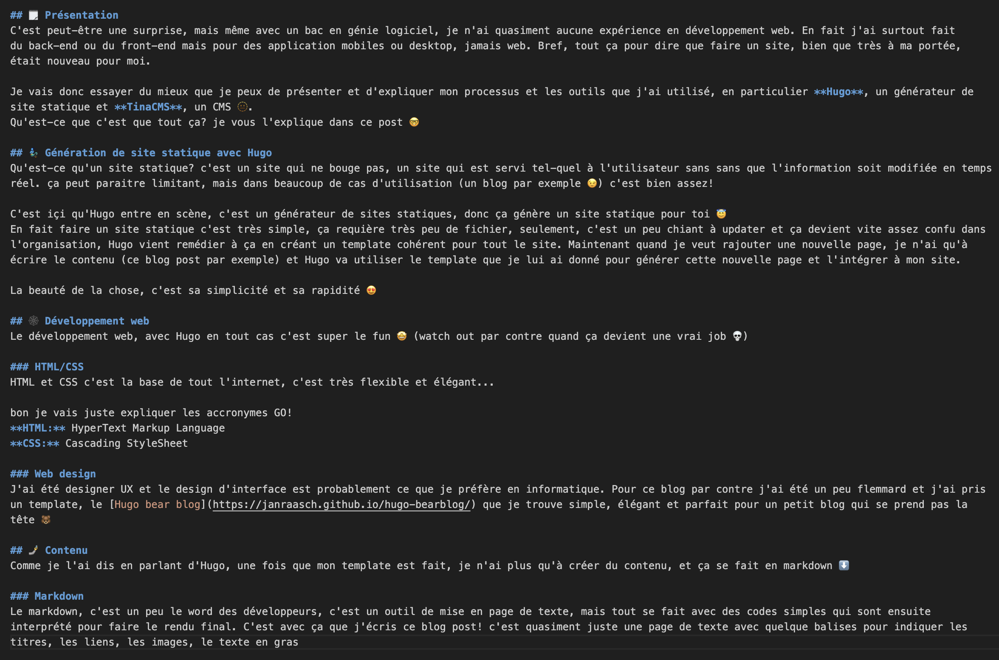

+++
title = "Apprentissages Sur Hugo"
date = "2025-05-30T16:04:13-04:00"

#
# description is optional
#
# description = "An optional description for SEO. If not provided, an automatically created summary will be used."

tags = ["dev"]
+++

## 🗒️ Présentation
C'est peut-être une surprise, mais même avec un bac en génie logiciel, je n'ai quasiment aucune expérience en développement web. En fait j'ai surtout fait
du back-end ou du front-end mais pour des application mobiles ou desktop, jamais web. Bref, tout ça pour dire que faire un site, bien que très à ma portée, était nouveau pour moi.

Je vais donc essayer du mieux que je peux de présenter et d'expliquer mon processus et les outils que j'ai utilisé, en particulier **Hugo**, un générateur de site statique et **TinaCMS**, un CMS 🫥.  
Qu'est-ce que c'est que tout ça? je vous l'explique dans ce post 🤓

## 🧞‍♂️ Génération de site statique avec Hugo
Qu'est-ce qu'un site statique? c'est un site qui ne bouge pas, un site qui est servi tel-quel à l'utilisateur sans sans que l'information soit modifiée en temps réel. ça peut paraitre limitant, mais dans beaucoup de cas d'utilisation (un blog par exemple 😉) c'est bien assez!

C'est içi qu'Hugo entre en scène, c'est un générateur de sites statiques, donc ça génère un site statique pour toi 😇  
En fait faire un site statique c'est très simple, ça requière très peu de fichier, seulement, c'est un peu chiant à updater et ça devient vite assez confu dans l'organisation, Hugo vient remédier à ça en créant un template cohérent pour tout le site. Maintenant quand je veut rajouter une nouvelle page, je n'ai qu'à écrire le contenu (ce blog post par exemple) et Hugo va utiliser le template que je lui ai donné pour générer cette nouvelle page et l'intégrer à mon site. 

La beauté de la chose, c'est sa simplicité et sa rapidité 😍

## 🕸️ Développement web
Le développement web, avec Hugo en tout cas c'est super le fun 🤩 (watch out par contre quand ça devient une vrai job 💀)

### HTML/CSS
HTML et CSS c'est la base de tout l'internet, c'est très flexible et élégant...

bon je vais juste expliquer les accronymes GO!  
**HTML:** HyperText Markup Language  
**CSS:** Cascading StyleSheet

### Web design
J'ai été designer UX et le design d'interface est probablement ce que je préfère en informatique. Pour ce blog par contre j'ai été un peu flemmard et j'ai pris un template, le [Hugo bear blog](https://janraasch.github.io/hugo-bearblog/) que je trouve simple, élégant et parfait pour un petit blog qui se prend pas la tête 🐻

## 🤳 Contenu
Comme je l'ai dis en parlant d'Hugo, une fois que mon template est fait, je n'ai plus qu'à créer du contenu, et ça se fait en markdown

### Markdown
Le markdown, c'est un peu le word des développeurs, c'est un outil de mise en page de texte, mais tout se fait avec des codes simples qui sont ensuite interprété pour faire le rendu final. C'est avec ça que j'écris ce blog post! c'est quasiment juste une page de texte avec quelque balises pour indiquer les titres, les liens, les images, le texte en gras. voici à quoi ça ressemble ⬇️

## 🦙 TinaCMS
Pour finir, j'aurais pu m'arrêter avec seulement Hugo pour mes besoins, mais comme je veut proposer mes services, ça me prenait un CMS (Content Management System). Un CMS ça permet de gérer ce fameux contenu d'une façon plus accessible pour quelqu'un qui n'y connais rien. En ce moment j'edit ce post directement sur le code du site, auquel j'ai accès, mais si par exemple un client veut faire ses propres modification sans que j'ai à aller dans le code, alors il utilise le CMS que j'ai mis à sa disposition.  

Il y a beaucoup de CMS, après avoir struggle avec une couple d'entre eux, je me suis arrêté sur TinaCMS qui est gratuit et open-source. Le CMS fonctionne en fait en offrant une interface simplifiée et accessible (on n'a qu'à rajouter /admin à l'url du site) pour créer du contenu qui sera ensuite ajouté au site par le CMS comme si c'était moi qui allait jouer dans le code. ce qui est bien, c'est que j'ai un contrôle sur ce qui peut être modifié, comme ça pas de surprises 😵‍💫
